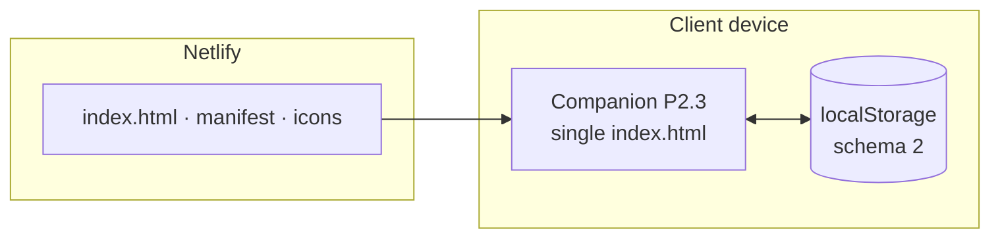
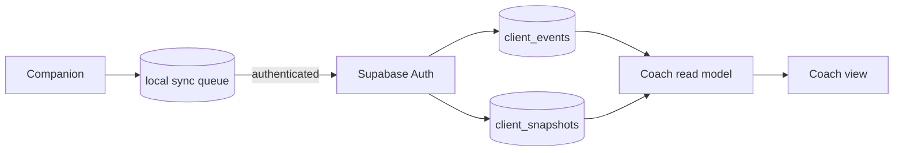

# Architecture

## Current P2.3 baseline

The client remains fully usable without a backend. Netlify serves code only; real client data stays in browser storage until the data-core phase is deliberately activated.

## Target data path

Identity is UUID-based and comes from authenticated context, not a first name in a payload. RLS is the authorisation boundary. Clients can write/read their own rows; an active coaching relationship grants the coach read access. The service role is reserved for controlled administrative operations.

## Invariants

1. **Local-first remains true.** Tracking and the resolved-day state do not depend on a network response.
2. **Production identity is not source configuration.** The public P2.3 source defaults to no named client.
3. **Origin is part of the data model.** localStorage is isolated by origin, so production hostname selection precedes real production use.
4. **Automatic sync is idempotent.** Client-generated event UUIDs can be safely retried.
5. **The coach sees a read model, not unrestricted tables.** Start with the smallest data surface needed for coaching.
